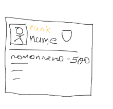
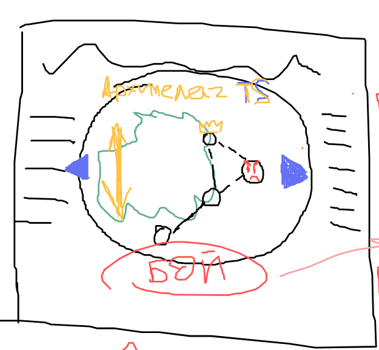
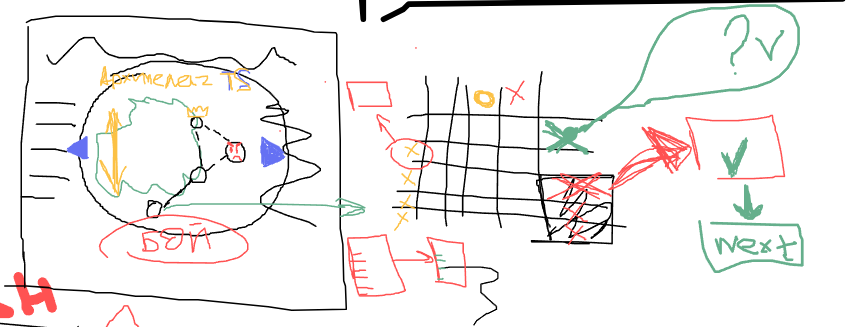

# Дата: 2026-03-01

Заметили маленькие несостыковки в нейминге коммитов и веток. На коротком собрании определились, что возьмём нейминг в стиле RSS. Команде пришлось переименовать пару веток и несколько коммитов.
С каждым обсуждением всё больше оттачиваем основной концепт игры. В ходе обсуждения нарисовали концепты страниц профиля и dash. Страница Profile будет заключать в себе статистику и основную информацию о пользователе (имя, ранг). Мы также рассматриваем внедрение клановой системы на финальных этапах разработки.

Основной экран будет иметь на себе карту архипелага/темы (Архипелаг TypeScript). На котором будет отображен набор уровней от jun до senior. Также мы не исключаем наличие дополнительных уровней с модификаторами (на время, без ошибок). Кроме того, на странице будут находиться элементы геймификации.

На текущий момент основной игровой процесс состоит из двух этапов: этап подготовки и этап игры. На этапе подготовки игрок drag and drop расставляет свои корабли по полю. На этапе игры игрок поочерёдно с компьютером выбирает клетки для атаки. Если на клетке находился вражеский корабль, то игроку задаётся вопрос по выбранной теме из пула со сложностью уровня. При правильном ответе ход игрока продолжается следующей атакой. При неправильном ответе корабль останется целым и ход перейдёт компьютеру. Мы допускаем реализацию функции расходников или способностей, влияющих на исходный счёт.

Черновик основного списка features всё ещё в работе. Нужно разбить его на issue по готовности
