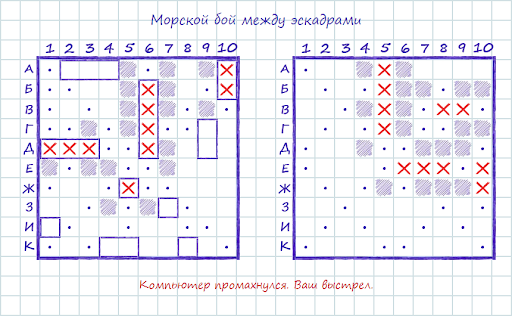
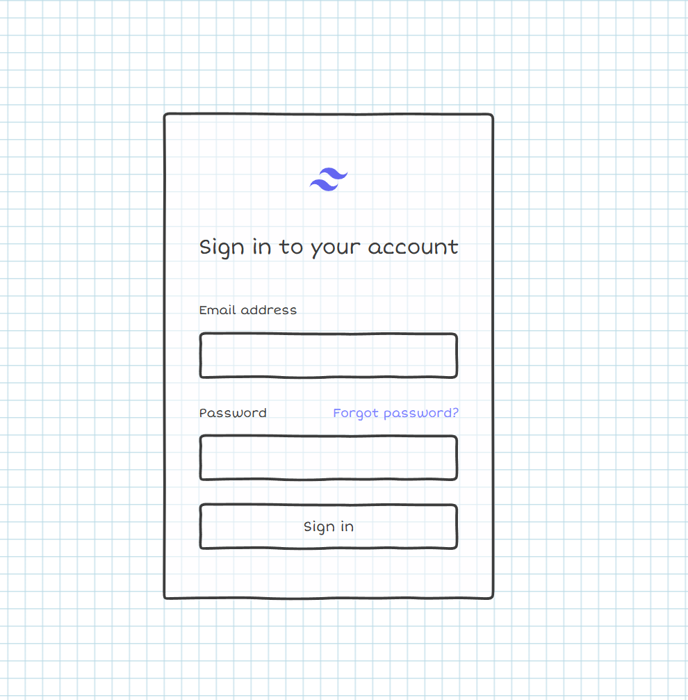
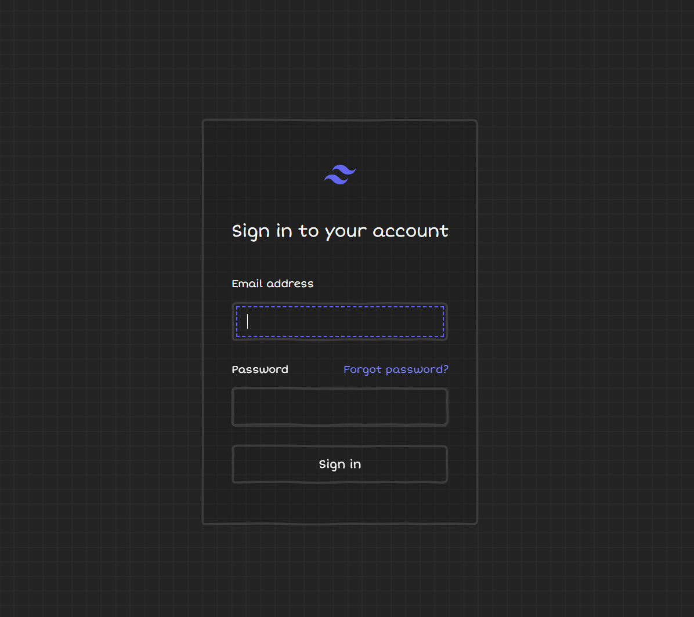

# Дата: 2026-03-05

На собрании определились с дизайном. Решили делать в стиле "От руки".

Нашёл неплохоую [библиотеку](https://github.com/chr15m/DoodleCSS/tree/main) с рукописными элементами интерфейса. Довольно долго мучался с попытками её удобно интегрировать с Tailwind. В библиотеку были захардкожены цвета шрифта и бэкграунда, и она перезаписывала стили Tailwind. Всё закончилось вендорингом библиотеки. В следующий раз стоит не искать лёгкий путь, а сразу разбираться в библиотеке и вендорить. Сделал Login в черновом варианте.

- **Проблемы:** У библиотеки нет удобных интерфейсов изменения цвета бордеров. Нужно что-то с этим придумать. Продолжать на практике погружаться в React и Tailwind.
- **Затраченное время:** 3 часа

